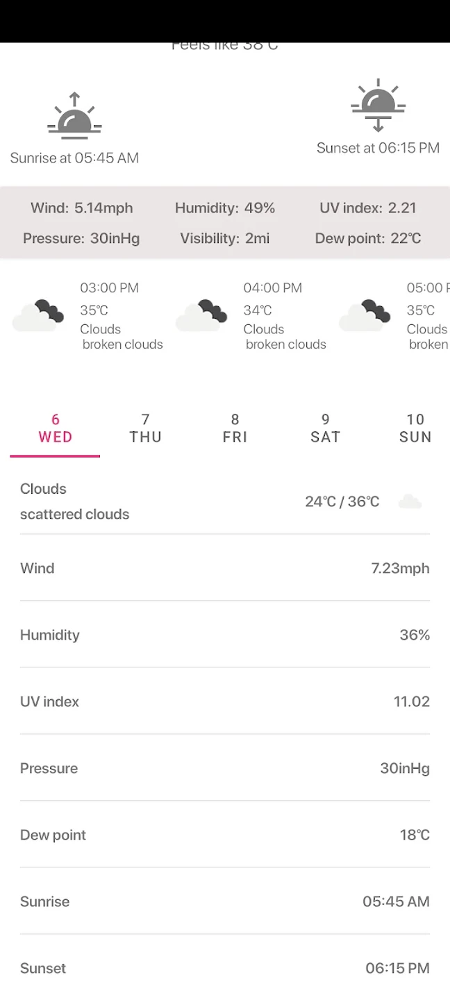

<table>
  <tr>
    <td align="center">
       
    </td>
    <td> <h1>Weather Genie</h1> A scientific yet simple approach to weather forecast. 
      Weather Genie App can tell you, which part of the day is going to have a clear sky and light breeze perfect for a run or bike ride for 7 days ahead.  
</td>
  </tr>
</table>

## Features
- Minimalistic design that gives you all the weather information you need including: feels Like, wind speed, atmospheric pressure, humidity, UV index and visibility.
- Hourly weather chart for the first 2 days and for every 3 hours in the following 6 days.
- Ad-free & free-to-use.

## Screenshots
   

## Tech Stack

**API:** [OpenWeather](https://openweathermap.org/api)

**Architecture:** Model–view–viewmodel (MVVM)

## Authors

- [Rakib Hasan](https://www.github.com/rakibhasan1030)

## Avaiable on

## Feedback

If you have any feedback, please reach out to me at rakibhasan1030@gmail.com
